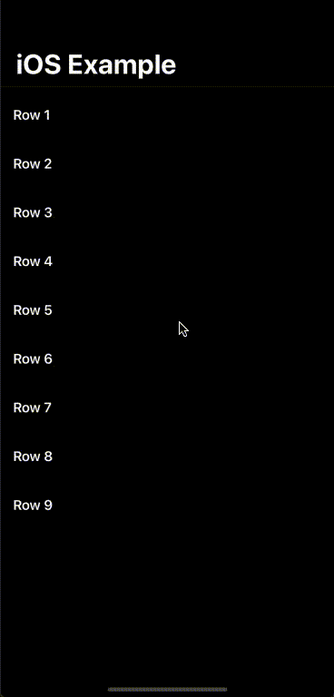
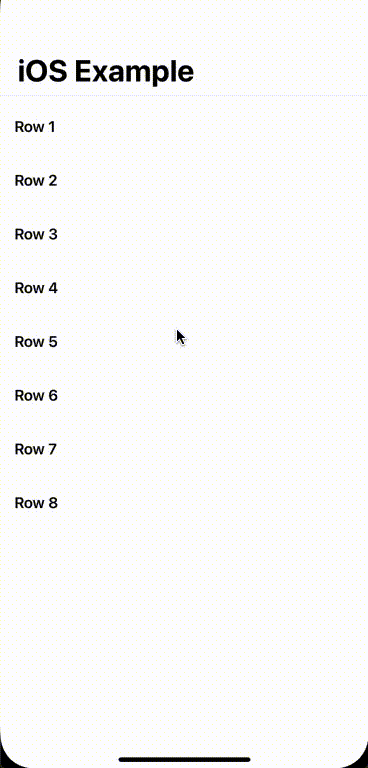

# BBRefreshableScrollView

A simple implementation of the very commonly used (yet surprisingly unavailable in SwiftUI framework) UIScrollView's pull to refresh functionality implemented natively in SwiftUI without using UIViewRepresentable. Package is compiled using Xcode 12.0 on MacOS 10.15.7 using Swift 5.3 compiler.

---

## Support

[](https://www.apple.com/in/macos/catalina/)
[](https://developer.apple.com/xcode/)
[](https://developer.apple.com/swift/)

---
## Code

```swift
import SwiftUI
import BBRefreshableScrollView

struct ContentView: View {

    @State private var rows = [1, 2, 3, 4]

    var body: some View {
        NavigationView {
            BBRefreshableScrollView { completion in
                addNewRow {
                    completion()
                }
            } content: {
                VStack {
                    Divider()
                    ForEach(rows, id: \.self) { row in
                        HStack {
                            Text("Row \(row)")
                                .fontWeight(.semibold)
                                .padding()
                            Spacer()
                        }
                    }
                }
            }
            .navigationTitle("iOS Example")
        }
    }

    func addNewRow(completion: @escaping () -> Void) {
        DispatchQueue.main.asyncAfter(deadline: .now() + 2) {
            rows.append(rows.count + 1)
            completion()
        }
    }
}
```
---
## Screenshots

<table>
  <tr>
     <td>Dark mode</td>
     <td>Light mode</td>
  </tr>
  <tr>
    <td></td>
    <td></td>
  </tr>
 </table>

 ---
 ## Installation

 ### Swift Package Manager

The [Swift Package Manager](https://swift.org/package-manager/) is a tool for automating the distribution of Swift code and is integrated into the `swift` compiler. It is in early development, but BBAlert does support its use on supported platforms.

Once you have your Swift package set up, adding BBAlert as a dependency is as easy as adding it to the `dependencies` value of your `Package.swift`.

```swift
dependencies: [
    .package(url: "https://github.com/bibinjacobpulickal/BBRefreshableScrollView", .upToNextMajor(from: "1.0.0"))
]
```
---
## Example
Clone or download the project. Open `.xcodeproj` file in Xcode. Change target to iOSExample and run on a device or simulator.

## License
BBAlert is released under the MIT license. [See LICENSE](https://github.com/bibinjacobpulickal/BBRefreshableScrollView/blob/master/LICENSE) for details.

